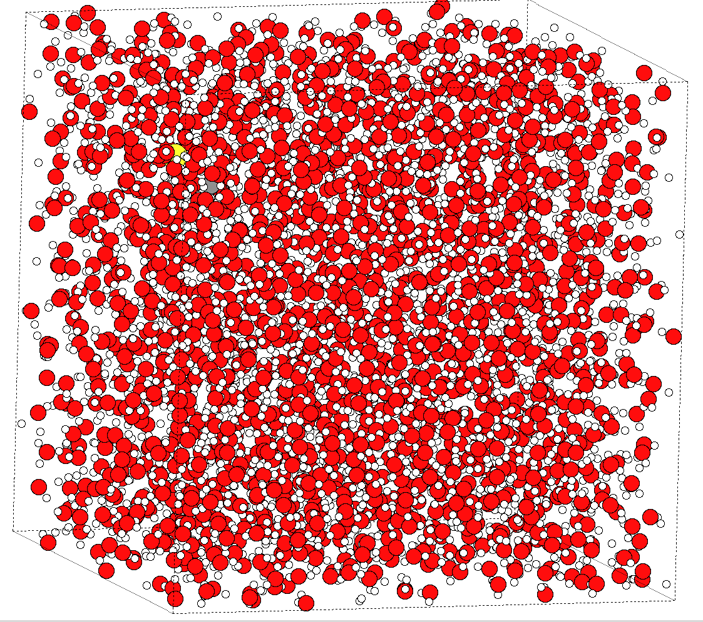
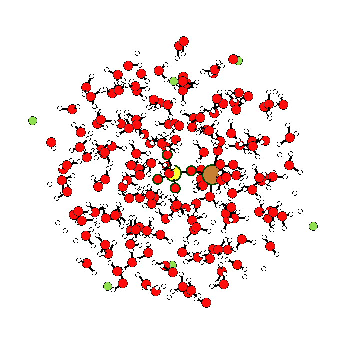

.. _cuso4:

*A case study by Rowan Hanson, Cardiff University. Funding is gratefully acknowledged from CCP5*

****************************************
Ion In A Liquid: Solvated CuSO\ :sub:`4`
****************************************

As a starting point for liquid systems, we consider an ionic molecule in a polar environment. This section of the tutorial will look at solvated CuSO\ :sub:`4`, and all of the example files are available in :mod:`docs/tutorial/samples/ionic_liquids/cuso4_solv/`, including an MD snapshot (*DL_POLY*) of the system

.. note:: If you want to extend this tutorial to your own systems, you will need MD snapshots. This tutorial uses a **CONFIG** and **FIELD** file from a *DL_POLY* MD simulation, and should be broadly applicable to most models run with *DL_POLY*

.. note:: In some of the *ChemShell* scripts given, there are commands left to allow visualisation of structures using `ASE <https://wiki.fysik.dtu.dk/ase/index.html>`_. These commands are commented out with a '#' symbol, as they are not essential for running the scripts, but can be enabled to aid understanding!

`1. Cutting the Cluster`_
=========================

.. note:: The scripts for this part of the tutorial can be found in :mod:`ionic_liquids/cuso4_solv/1_cuso4_cluster/`. Cluster cutting can be computationally intensive for large files; The example given took in excess of 4 hours on a standard desktop machine.

.. This overhead for cutting clusters is definitely something to address in future work.

With a CONFIG file obtained from a DL_POLY molecular dynamics simulation, we can cut a cluster to prepare for **QMMM** calculations. You will also need to You will also need to obtain the atom charges from your *FIELD* file as the third column below:

.. literalinclude:: ../../../samples/ionic_liquids/cuso4_solv/1_cuso4_cluster/FIELD
    :lines: 7-11

.. warning:: The labelling of atoms in the *CONFIG* file is extremely important; labels that do not corresond to a real element name or 'X'/'x' (dummy) will need to be changed manually to a "real" name so that the chemical identity of the atom centres can be identified. 

    For example, an atom labelled MU needs to be changed to XU to represent a dummy in Py-ChemShell. This labelling change can be done via the commandline with :mod:`sed -i 's/MU/XU/g' <filename>` if there are multiple entries.

To cut a cluster, the following parameters are required and can be changed to achieve the desired result:

* :mod:`radius_cluster` - This is the radius of the spherical cluster you want to cut.
* :mod:`radius_active` - This is the radius of the spherical cluster you want to be set as active in any subsequent optimisation calculations, with a frozen surrounding environment. This value has a range up to that of the :mod:`radius_cluster`.
* :mod:`origin_atom` - This dictates where the centre of the cluster should be. Ideally, the central atom should be set as closest to the centre of the point of interest for your simulation; if not included, this defaults to the first atom in your CONFIG file, *atom 0*.
* :mod:`bq_margin` - the physical space between the main cluster and the background charges (bqs), in a\ :sub:`0`.
* :mod:`bq_density` - the quantity (density) of point bqs embedding the cluster.

Other parameters may also be set and are found in :mod:`chemsh/cluster/__init__.py`.

.. literalinclude:: ../../../samples/ionic_liquids/cuso4_solv/1_cuso4_cluster/construct_cluster.py
    :lines: 1, 5-17

Above is a *Py-ChemShell* script for cutting a cluster from a CONFIG file. Note the connectivity mode (:mod:`connmode`) is set to ionic and the charges from the *FIELD* file have been added using :mod:`.addCharges`. A *.pun* file is saved, containing the cut cluster which will be used in a the next step.

.. We should look to adapt the software so it can scrape the charges from CONFIG, I think.

The cluster cut by this tutorial is presented below, and can be viewed by the user using the :mod:`view.py` Py-ChemShell script in :mod:`samples/ionic_liquids/cuso4_solv/`. The image has been zoomed in, which cuts off some of the long-range point charges (BQs); the highlighted atoms are the Cu and SO\ :sub:`4` subunits.

`2. Partitioning the Cluster`_
==============================

.. note:: The scripts for this part of the tutorial can be found in :mod:`ionic_liquids/cuso4_solv/2_cuso4_partition/`.

The :mod:`.pun` file written in step **1** is now used as the input coordinates file so we can define QM and MM regions for our calculations. Each atomic label is appended with an integer value to represent the region for this atom, ranging between 1 and 5.

.. warning:: It should be noted here that, in the original CONFIG file any environments that are numerical, e.g. *W1* and *Cs2*, will need to be changed to a non-numeric environment, e.g. *W_a* and *Cs_b*. A bulk way of doing this was described in step **1**.

For example, below is an extract from the cluster cut in step **1**:

.. literalinclude:: ../../../samples/ionic_liquids/cuso4_solv/2_cuso4_partition/cuso4_solv.pun
    :lines: 1-19

and the script to transform this into a partitioned cluster and save is:

.. literalinclude:: ../../../samples/ionic_liquids/cuso4_solv/2_cuso4_partition/partition_cluster.py
    :lines: 1, 4-16

Here, we have selected the atoms we'd like to be quantum mechanical by appending a "1" to their name, using a :mod:`for` loop. Then, we have run the partitioning function, passing on this information, with many other parameters also included to set:

* :mod:`cutoff_boundary` - radius around the QM region for which the interfacial region "2" is included in the partitioning.
* :mod:`radius_active` - as in previous step, the radius of the active region - this should be kept the same.
* :mod:`orgin` - as in previous step, so should be kept the same.
* :mod:`qmmm_interface` - explicit or implicit, which dictates if region "2" atoms (interfacial cations) should be included in the QM region (:mod:`implicit`) or excluded (:mod:`explicit`).
* :mod:`interface_exclude` - a list of atom labels that should not be included in the interfacial region "2".

Other parameters may also be set and are found in :mod:`chemsh/cluster/partition.py`.

`3. Calculating the Single-Point Energy`_
=========================================

.. note:: The scripts for this part of the tutorial can be found in :mod:`ionic_liquids/cuso4_solv/3_cuso4_spoint/`.

In the previous step the outcome was saved as a *.pun* file :mod:`cuso4_solv_regions.pun`:

.. literalinclude:: ../../../samples/ionic_liquids/cuso4_solv/2_cuso4_partition/cuso4_solv_regions.pun
    :lines: 1-14

We now calculate the single-point energy of the system with two different approaches: molecular mechanics (MM) only, to illustrate the basic concept of an energy calculation, and then using partitioned quantum and molecular mechanics (QM\MM). In both cases we need the *FIELD* file from the MD simulation in order to ensure correct representation of the MM interactions.

Calculating the Single-Point Energy with MM
___________________________________________

To run this calculation, we use the *.pun* file created in step *1*. As we are not considering regions here, numerical labels are not present to indicate partitioning. We use a relatively simple ChemShell script to perform the energy calculation:

.. literalinclude:: ../../../samples/ionic_liquids/cuso4_solv/3_cuso4_spoint/mm_only/spoint_mm.py
    :lines: 1-2, 5-9, 12, 14, 26-35

Here, the main settings are:
    * :mod:`mm_theory` - a variable that we have set to use the *DL_POLY* interface.
        * :mod:`frag` - cluster Fragment, defined earlier in the script as the :mod:`cuso4_solv.pun` file.
        * :mod:`ff` - forcefield to be read in, which we have assigned higher up in the script.
    * :mod:`sp.run()` - command for running a single-point energy calculation.
        * :mod:`theory` - defined as :mod:`mm_theory`.
        * :mod:`gradients` - flag to denote if gradients are required (*True*); if not, this is *False* by default.

Included in all scripts with energy calculations within this tutorial is a reference energy. This is the energy obtained when creating these tutorials; if settings are kept the same and the tutorial is followed, the result of running any energy calculation will return a *Pass* to indicate matching energies. If parameters are changed, the energy of the simulation will change and the sanity check will *Fail*; however, remember that this does **not** mean the calculation failed, or that insensible parameters have been used.

Calculating the Single-Point Energy (QMMM)
__________________________________________

To perform a QM/MM calculation, we use the *.pun* file created at the end of step *2*. We recommend to create a backup copy of the working files in case anything goes wrong!

Firstly, we need to update our *FIELD* file and *cuso4_solv_regions.pun* so that the atom labels match. This can be done using the :mod:`sed -i` command seen earlier in this tutorial, and is necessary to de-clutter the *FIELD* file. For instance, thus far 4 oxygen atoms associated with SO\ :sub:`4` are labelled independently, but these species are all identical and so each label can be changed to match (i.e. O_a and O_b become O_s) and duplicate terms then removed from the *FIELD*. The same can be done with the water molecule, such that the oxygen and hydrogen labels are all the same (i.e. O_w and H_w).

The next step is to edit the *FIELD* file so that only the parts of the system we want described by MM are included in the simulation (i.e. solvent environment). In sequential order, one must perform the following changes:

* As only water is described by MM, line 3 needs to be changed from :mod:`molecules 3` to :mod:`molecules 1`.
* All the lines below line 3, down to (but not including) *SPCE*, need to be commented out as these reference the SO\ :sub:`4` and Cu moieties (which are now represented by QM).
* :mod:`rigid 1` and :mod:`3 1 2 3` are also not required and so can be commented out.
* Finally, any of the remaining lines that start with an S, O_s or CU need to be commented out; In this case we are left with only 3 lines in this section of the file (for the water molecule interaction), which means :mod:`vdW` needs to be changed from *30* to *3*.

.. literalinclude:: ../../../samples/ionic_liquids/cuso4_solv/3_cuso4_spoint/qmmm/FIELD

Now, to run the calculation we need a Py-ChemShell script. This is similar to the MM only script seen before with some notable exceptions.

.. literalinclude:: ../../../samples/ionic_liquids/cuso4_solv/3_cuso4_spoint/qmmm/spoint_qmmm.py
    :lines: 1-2, 5-14, 14-15, 16-25, 27-33, 35

Here we have added several new settings:
    * :mod:`qm_theory` - we have chosen to use `NWChem <http://www.nwchem-sw.org/images/Nwchem_manual.pdf>`_ as the quantum mechanical calculator. We have used a very basic level theory, *scf*, with a small basis set, *3-21g*, and a multiplicity of 2, :mod:`mult=2` (spin multiplicity 2S + 1).
    * :mod:`qm_region` - In this case we have used the :mod:`range()` function to set the first *6* atoms (Cu and SO\ :sub:`4`) of the geometry file at QM active; one can alternatively request the indices of the 14 QM atoms with :mod:`qm_region = cuso4_solv.getRegion(1)`
    * The theory, :mod:`qmmm`, is set and includes how the *coupling* exists and the type of MM *embedding*.

Comparison with Single-Point Energy of the QM Only
__________________________________________________

To best understand how including a solvent shell around a molecule changes the outcome of the calculation, we can do a QM calculation on just the CuSO\ :sub:`4`. 

The easiest way to do this is after completing the QMMM calculation above:
    - Copy all of the *nwchem* files in to the :mod:`qm_only` directory. 
    - Edit the :mod:`_nwchem.inp` file to delete all the coordinates in the section *bqs*, including *bqs* and *end*, such that all that is left is the preamble at the beginning, the coodinates of the CuSO\ :sub:`4`, the basis definition, the method definition and the task type.
    - Run this calculation using the standalone nwchem executable this: :mod:`nwchem _nwchem.inp`

Compare the energies of the solvated and isolated systems, and also consider how the energy levels of the electrons change.

.. This needs to be more insightful e.g. comment on the differences for the user to observe. Needs someone to rerun this.

`4. Geometry Optimisation`_
===========================

.. note:: The scripts for this part of the tutorial can be found in :mod:`ionic_liquids/cuso4_solv/4_cuso4_opt/`.

Geometry optimisation is done in a similar way to that of the single-point energy calculation, in that a qm_theory and a mm_theory are defined. The major change is that an optimisation object must be defined to manage the geometry optimisation, as illustrated below:

.. literalinclude:: ../../../samples/ionic_liquids/cuso4_solv/4_cuso4_opt/opt_energy.py
    :lines: 1-45

Here, we have defined an "active" region for the geometry optimisation using the :mod:`getNotQM` command, i.e. everything outside the QM region is frozen. Other settings such as :mod:`tolerance` define the gradient threshold to be reached if the optimisation is deemed converged.

As per the single-point energy, one can extract the QM details and calculate the energy of the isolated CuSO\ :sub:`4` if you want to compare the effect of including a solvent in the calculation.

.. It'd be good to include this simulation within the Python script, rather than sending the user to do it themselves externally.
