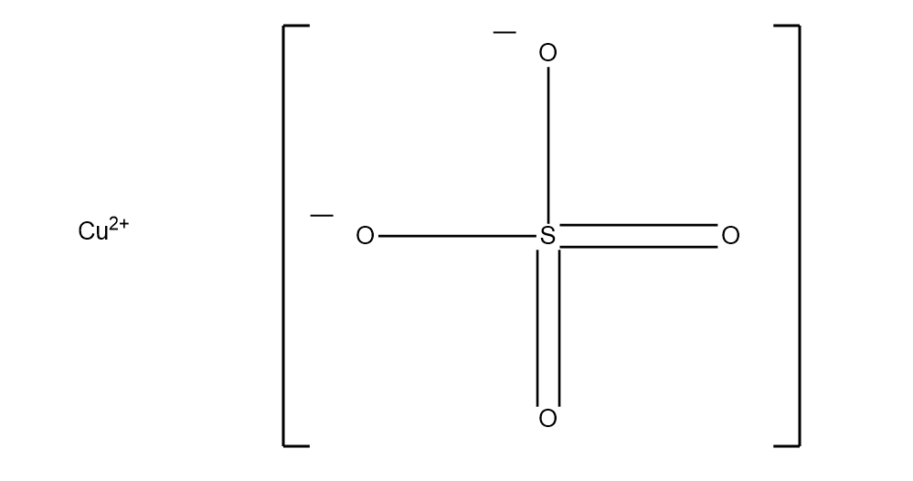

.. chemshpy documentation master file, created by
   sphinx-quickstart on Tue Aug 15 13:23:13 2017.
   You can adapt this file completely to your liking, but it should at least
   contain the root `toctree` directive.

*A case study by Rowan Hanson, Cardiff University. Funding is gratefully acknowledged from CCP5*

******************************
**Working With Ionic Liquids**
******************************

.. toctree::
   :maxdepth: 2
   :caption: Contents:

   cuso4/index
.. bmimotf/index

The following tutorials show how to setup and run simulations for liquid-phase systems with **Py-ChemShell**, showcasing integration with the molecular dynamics software package **DL_POLY**. We will work sequentially through cluster construction, partitioning in to separate regions, running energy calculations and performing geometry optimisations.

.. Our original ambition was to compare embedded-cluster results with gas-phase, including for structures and orbital levels, before using higher-level approaches and also running NMR simulations. This was not completed in the allocated project timeframe.

In order to run these simulations, you will need to have Py-ChemShell, DL_POLY and NWChem installed on your computer.

.. note:: This tutorial will assume you have run MD simulations on a condensed phase system as either a single salt molecule solvated or a pure ionic liquid. It is also assumed that *DL_POLY* has been used as the MD simulation package, however some of the practices in this tutorial will be transferable to other packages.

 In this tutorial, we will consider a single salt molecule, CuSO\ :sub:`4`, solvated by water.

.. Again, this was a target for the tutorial but not achieved in the timeframe.
.. * Second we will consider a pure ionic liquid, BMIM OTf or *1-butyl-3-methylimidazolium trifluoromethanesulfonate*

.. .. image:: BMIM_OTf.png
   :width: 750px
   :height: 500px
   :scale: 50 %
   :alt: alternate text
   :align: center

