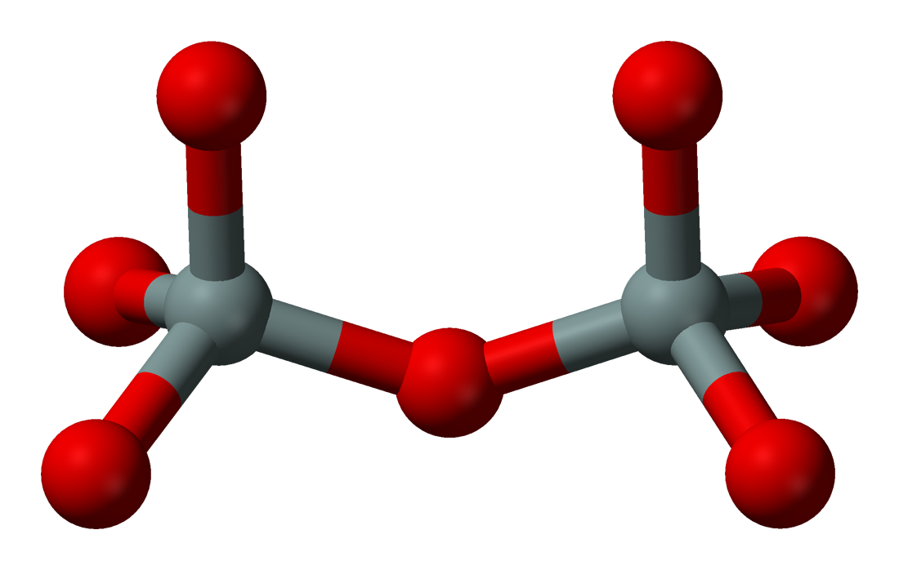
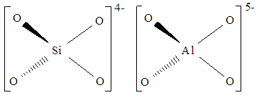

.. _cut_spoint_opt:

********************************************************
Cluster formation, Single-point energies & Optimizations
********************************************************

Obtaining crystals
==================

Different siliceous/zeolite structures are found at `IZA <http://europe.iza-structure.org/IZA-SC/ftc_table.php>`_.

The structure that is used to create the initial cluster is: MFI.

.. image:: MFI_010.jpg
   :width: 600px
   :height: 400px
   :scale: 50 %
   :alt: alternate text
   :align: center

`1. Setting up the QM/MM embedded-cluster`_
===========================================

The first thing that must be done is cutting a large siliceous framework into a smaller siliceous cluster. Siliceous simply means that the structure contains only Si and O atoms. Each Si atom is bound to 4 O atoms, and each O atom is bound to 2 Si atoms. As such, the structure contains this repeating unit:

The siliceous cluster is constructed by running the input file :mod:`construct_mfi.py`, located in the directory :mod:`zeol_covalent/1_construct_silicate`.

.. literalinclude:: ../../samples/zeol_covalent/1_construct_silicate/construct_mfi.py
   :lines: 1-13

The periodic input structure :mod:`mfi` is created as a fragment with coordinates read from :mod:`mfi.c`.

By using the :mod:`construct_cluster()` function on the fragment, the large mfi framework is cut to produce an mfi cluster. The variables included in this function are:

- :mod:`radius_cluster` : Determines the size of the cluster. This is in units Bohr (\ :math:`a_{0}`\ )

- :mod:`origin_atom` : The central atom that the cluster is based around.

- :mod:`adjust_charge` : Adjusts the charges of the covalently bonded atoms at the periphery surface of the cluster to account for the bonds that were cleaved as a result of the cluster generation

- :mod:`radius_active` : Sets the size of the sampling region. This should be at least as large as the largest optimisation region you intend to use.

- :mod:`bq_margin` and :mod:`bq_density` : Set the number and position of the point charges around the edge of the cluster to approximate the missing periodic electrostatic interactions. (‘F’ is arbitrarily used to denote this inside the cluster).

Any structure can be saved by running the :mod:`save()` function, giving a filename and filetype. In our example, we have used .pun files, due to our method of defining the qm/mm regions in the structure, but alternatives include .cjson and .xyz.

The resulting cluster from the :mod:`construct_cluster()` function is saved as :mod:`mfi.pun`. This file contains the coordinates, charge and connectivity of all of the atoms in the cluster. We will continue to use this file in the production of a zeolite cluster as well as further siliceous cluster calculations. Therefore, it has been copied across to succeeding directories.

`2. Conversion to zeolite`_
===========================

Now that a silicate base has been established, we can make the necessary changes to produce a zeolite by running the :mod:`construct_zsm5.py` file, located in the directory :mod:`zeol_covalent/2_construct_zeol`. Below is an explanation of the code that carries out this procedure.

Before any ammendments can be made, the :mod:`mfi` cluster fragment is produced using coordinates read from :mod:`mfi.pun`. After this, the :mod:`mfi` cluster fragment is displayed using the :mod:`print_frag()` function:

.. literalinclude:: ../../samples/zeol_covalent/2_construct_zeol/construct_zsm5.py
   :lines: 10-15

The first step in converting the silicate to a zeolite is exchanging an Si atom for an Al atom. All of the atom labels and atomic numbers in the cluster can be accessed/altered with :mod:`names` and :mod:`znums`, specifying the index. As python counts from 0, the first atom has index 0, and thus the 551st atom has index 550.

.. literalinclude:: ../../samples/zeol_covalent/2_construct_zeol/construct_zsm5.py
   :lines: 18-19

However, if we compare the Al centre of the cluster now with the Si centre of the cluster before the substitution...

As you can see, the charges of the hypothetical complex are not balanced. Si has a charge of 4+ in the fragment, and each O has a charge of 2-. Thus, with a Si atom bound to 4 O atoms, the overall charge is 4-. Al has a charge of 3+ in the fragment. Bound to 4 O atoms, the overall charge is 5-. 

Therefore, we **must** add a H atom the structure to compensate for the charge. This H addition is carried out via the :mod:`insert()` function using positional arguments.

.. literalinclude:: ../../samples/zeol_covalent/2_construct_zeol/construct_zsm5.py
   :lines: 20

The coordinates and charge of the newly inserted atom are updated respectively to replicate that of the Si atom that was deleted.

.. literalinclude:: ../../samples/zeol_covalent/2_construct_zeol/construct_zsm5.py
   :lines: 21-22

The updated :mod:`mfi` cluster fragment is displayed using the :mod:`print_frag()` function, and the contents saved in a new file :mod:`zsm5.pun` using the :mod:`save()` function. As this is needed in further zeolite scripts, it has been copied across to succeeding directories.

`3. Single-point energy calculation of the silicate`_
=====================================================

A single-point energy calculation can be carried out on the silicate by running the input file :mod:`mfi_sp.py` found in the directory :mod:`zeol_covalent/3_silicate_sp`.

Like in section 2, the fragment :mod:`mfi` is created using coords read from :mod:`mfi.pun`.

After we cut the cluster, a quantum mechanical (qm) region and molecular mechanical (mm) region is formed. Each region is processed using a different calculator. We specify how each of the regions are dealt with using :mod:`qm_theory` and :mod:`mm_theory`.

.. literalinclude:: ../../samples/zeol_covalent/3_silicate_sp/mfi_sp.py
   :lines: 8-12

:mod:`qm_theory` uses NWChem as the calculator and thus uses NWChem arguments. The :mod:`qm_theory` method :mod:`scf` and the basis file :mod:`3-21g` have been chosen as the default due to their speed. 

:mod:`mm_theory` uses GULP as the calculator and thus uses GULP arguments; the forcefield used for gulp is :mod:`zeolite_gulp`, which is introduced first.

If you would like to obtain a more accurate value, at the cost of a more lengthy procedure, changes can be made to the :mod:`qm_theory` and :mod:`mm_theory` .i.e. changing the parameters to include :mod:`dft` in the :mod:`qm_theory` method with :mod:`conjugate=True` in :mod:`mm_theory`.

.. literalinclude:: ../../samples/zeol_covalent/3_silicate_sp/method_alternative.py
   :lines: 1-11

Now, we must define the atoms that in the qm region that will be used in the NWChem calculator.

.. literalinclude:: ../../samples/zeol_covalent/3_silicate_sp/mfi_sp.py
   :lines: 13

All atoms in the QM region are defined by a ':mod:`1`' suffix on their labels in the zsm5.pun file. The :mod:`getRegion(1)` function places these selected atoms in a list called :mod:`qm_region`.

.. note:: If you wish to change the atoms selected to be part of the QM region, open the zsm5.pun file using a text editor. This can be done by entering the command :mod:`vi zsm5.pun`. To edit the file, enter ':mod:`i`' and make the necessary changes. When the changes are complete, exit the editor mode by entering :mod:`esc`. Leave the visualiser and save the changes by entering ':mod:`:wq`'.

We introduce a dipole-adjust which adjusts the charge of the qm/mm boundary atoms for a more accurate energy value. Each cluster will have it's own specific dipole-adjustment depending on the atoms present, which is set using :mod:`bond_modifiers`.

.. literalinclude:: ../../samples/zeol_covalent/3_silicate_sp/mfi_sp.py
   :lines: 16

The above parameters all come together to form the :mod:`qmmm` object which is necessary to run the energy calculation. There are a few additional arguments defined within the object. The use of a dipole adjust can be initiated if the parameter :mod:`dipole_adjust` is set to true.

.. literalinclude:: ../../samples/zeol_covalent/3_silicate_sp/mfi_sp.py
   :lines: 19-26

Finally, the :mod:`sp` object is prepared using the theory :mod:`qmmm` as an argument. This is what is used to calculate the single-point (sp) energy of the cluster when we apply the :mod:`run()` function.

.. literalinclude:: ../../samples/zeol_covalent/3_silicate_sp/mfi_sp.py
   :lines: 29-31

`4. Single-point energy calculation of the zeolite`_
====================================================

A single-point energy calculation can be carried out on a zeolite cluster by running the file :mod:`zsm5_sp.py` found in the directory :mod:`zeol_covalent/4_zeolite_sp`.

Instead of using an mfi cluster fragment created from mfi coordinates, the zeolite cluster fragment :mod:`zsm5` is created using coords read from :mod:`zsm5.pun`.

.. literalinclude:: ../../samples/zeol_covalent/4_zeol_sp/zsm5_sp.py
   :lines: 4

The rest of the python script is exactly the same as that used in calculating a silicate cluster sp energy, with :mod:`zsm5` replacing :mod:`mfi` every time the fragment is called.

`5. Optimization of silicate`_
==============================

We can optimize the clusters that we have produced to find their lowest energy state. During the optimization process, the atoms in the cluster will change their coordinates slightly with each successive cycle that runs until the lowest energy state is found, or the energy has 'converged'.

Optimization of the silicate can be done by running the input file :mod:`mfi_opt.py`. This is found in the directory :mod:`zeol_covalent/5_silicate_opt`.

The layout replicates that of the single point energy: the :mod:`qm_theory`, :mod:`mm_theory`, :mod:`qm_region`, :mod:`silicate_modifiers` and :mod:`qmmm` object are all defined. After, there are a few minor differences.

To begin, we must define the atoms that will be frozen during the optimization process. These atoms are any that lie outside of the :mod:`qm_region`. As such, we use the :mod:`getNotQm()` function to define these atoms.

.. literalinclude:: ../../samples/zeol_covalent/5_silicate_opt/mfi_opt.py
   :lines: 31

This function uses the number of atoms in the cluster fragment (accessed via :mod:`natoms`) as well as the current :mod:`qm_region` as the parameters. The resulting atoms are all placed into a list, called :mod:`frozen`. To access this function, we must import it from the file :mod:`getFrozen`.

.. literalinclude:: ../../samples/zeol_covalent/5_silicate_opt/mfi_opt.py
   :lines: 2

Instead of using the :mod:`sp` object to find the single-point energy of the cluster, we use the :mod:`opt` object to optimize the cluster.

 .. literalinclude:: ../../samples/zeol_covalent/5_silicate_opt/mfi_opt.py
   :lines: 34-38

The :mod:`opt` object includes the following parameters:

- :mod:`theory` : Specifies where the object gets its atomic data from. Set to qmmm to use data from the :mod:`qmmm` object.

- :mod:`algorithm` : Specifies the optimisation algorithm. Here it is defaulted as lbfgs.

- :mod:`tolerance` : Determines how narrow the convergence criteria is. The smaller the tolerance, the more cycles the optimization will require. A wide tolerance may only require 1 cycle, and there may be no change in the structure/energy at all. 

- :mod:`maxcycle` : Determines the number of optimisation cycles. When the energy has converged the cycles will stop automatically.

- :mod:`maxene` : Determines the maximum number of energy and gradient calculations per cycle.

- :mod:`frozen` : Specifies which atoms will be frozen during the calculation. Uses list produced by :mod:`getNotQm()` function.

The optimization calculation is carried out using the :mod:`run()` function on the :mod:`opt` object. 

After the structure has been optimized, the reverse dipole adjust is applied to the fragment using the opposite adjustments. 

 .. literalinclude:: ../../samples/zeol_covalent/5_silicate_opt/mfi_opt.py
   :lines: 41

 .. literalinclude:: ../../samples/zeol_covalent/5_silicate_opt/mfi_opt.py
   :lines: 17-18

As you can see, the python script includes not only the :mod:`silicate_modifiers`, but the :mod:`reverse_silicate_modifiers` too. This is so we do not have a double dipole-adjustment applied to the cluster in further calculations.

The optimized structure is saved in the file :mod:`optimized_mfi.pun` using the :mod:`save()` function. We will use this file from now on in following procedures to produce more precise mfi fragments, and thus it has been copied across to succeeding directories.

`6. Optimization of zeolite`_
=============================

Optimization of the zeolite can be executed by running the input file :mod:`zsm5_opt.py` in the directory :mod:`zeol_covalent/6_zeol_opt`. 

Instead of using an :mod:`mfi` cluster fragment created from :mod:`mfi` coordinates, the zeolite fragment :mod:`zsm5` is created using coords read from :mod:`zsm5.pun`.

.. literalinclude:: ../../samples/zeol_covalent/6_zeol_opt/zsm5_opt.py
   :lines: 5

The rest of the python script is exactly the same as that used in calculating a silicate cluster sp energy, with :mod:`zsm5` replacing :mod:`mfi` every time the fragment is called.

The resulting optimized structure is saved in the file, :mod:`optimised_zsm5.pun`, which will be used in all following zsm5 calculations for more precise fragments.

