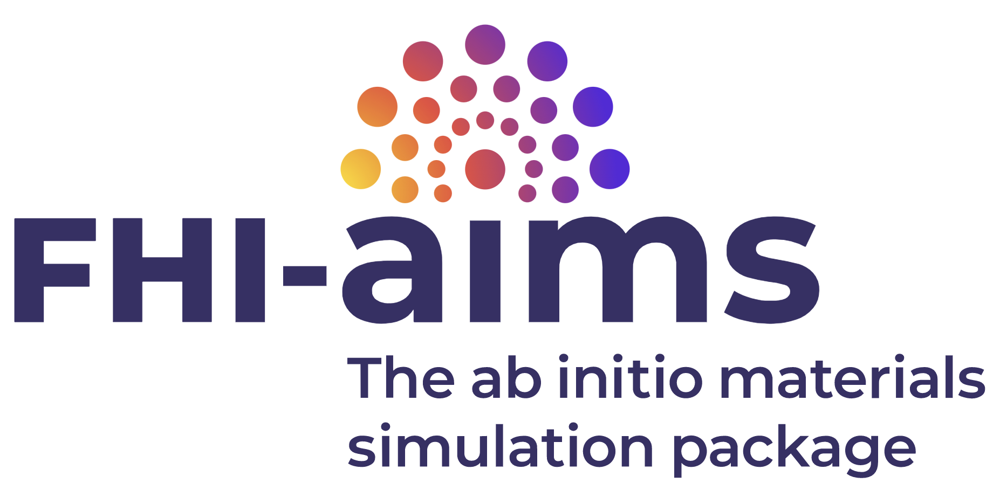
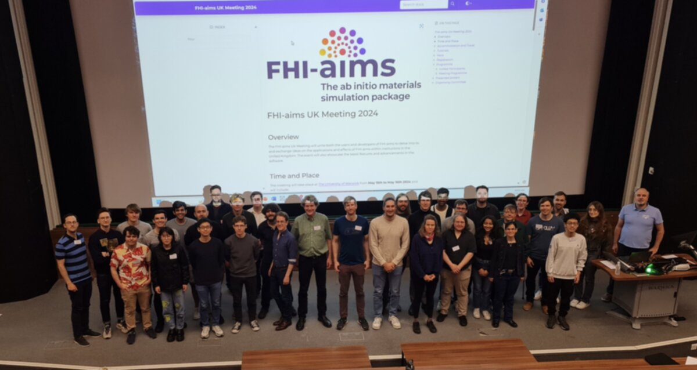

.. Title 
   sphinx-quickstart on Thu Aug 17 11:52:52 2017.
   You can adapt this file completely to your liking, but it should at least
   contain the root `toctree` directive.

.. Removed for now as not working on my implementation 
   :scale: 60 %

FHI-aims UK Meeting 2024
========================

.. toctree::
   :maxdepth: 2
   :caption: Contents:

Overview
--------

The FHI-aims UK Meeting will unite both the users and developers of FHI-aims to delve into to and exchange ideas
on the applications and effects of FHI-aims within institutions in the United Kingdom. The event will also showcase the latest
features and advancements in the software.

Time and Place
--------------

The meeting will take place at `The University of Warwick <https://warwick.ac.uk/>`_ from **May 15th to May 16th 2024** and will include:

* Tutorials: 09:00 - 12:00 May 15th
* Presentations and Posters: 12:00 May 15th - 13:00 May 16th
* Hack: 14:00 - 18:00 May 16th

The venue for the meeting is the Science Concourse within the Physics Department of the University of Warwick.
Directions can be found on this `interactive campus map <https://campus.warwick.ac.uk/>`_.

Directions to the conference rooms, campus accomodation and dinner location can be found on `this map <./images/Map2.png>`_.

Accommodation and Travel
------------------------

Accommodation options include a limited number of rooms available to be booked on the university campus for attendees through `Warwick Conferences <https://warwick.ac.uk/services/conferences/bed-and-breakfast/>`_.
Alternatively, accommodation is generally available within Coventry city (a short bus ride from the campus).

Travel to the University of Warwick is achieved easily through rail connections to **Coventry station** and then a bus journey from outside the station to the campus.
More information about how to get to the university can be found on the `university website <https://warwick.ac.uk/about/visiting/directions/>`_.

Tutorials
---------

.. This meeting will include a number of tutorials before the main sessions of talks. The topics of these tutorials are ultimately to be driven by what attendees wish to
.. see tutorials on however there will be a session on the fundamentals of FHI-aims and how best to utilise the software.
.. Currently suggested topics include:
.. 
.. * A general introduction to FHI-aims
.. * Excited state calculations
.. * ASI API
.. * MPE implicit solvation
.. * Beyond DFT methods 
.. * Embedding
.. 
.. Other, more advanced tutorials may be available with enough interest and will be published here in due course.
.. 
.. **Full schedule TBA**

.. .. include:: tutorials.rst

Tutorials will run in a linear fashion form 09:00 to 12:00 on May 15th, with a coffee break at 10:00. The tutorials will cover, in order; an introduction to FHI-aims, hybrid DFT (including a discussion on performance optimisation), RPA and GW. Simultaneously, there will also be expert offshoots to discuss particular methods or topics. 

The sessions will be hands-on and require a precompiled FHI-aims binary and license. Instructions for obtaining the software can be found `on the FHI-aims webpage <https://fhi-aims.org/get-the-code-menu/get-the-code/>`_, and any license requirements should be completed prior to arrival. Support will also be available onsite from MS1P. 

Hack
----

Following the presentation schedule of the meeting, all attendees are invited to a code hack, wherein the developers of the codebase will get together and take part in some
collaborative coding. The organisers would like to invite anyone with a suggestion for features to be included in FHI-aims to discuss these at the meeting with the
developers. `Ideas for topics to address can be logged on a GitLab issue here <https://aims-git.rz-berlin.mpg.de/aims/FHIaims/-/issues/549>`_. 

Registration
------------

**Registration is now closed.**

.. 
.. `Link to registration form <https://docs.google.com/forms/d/e/1FAIpQLSfnNcYyuUEcqnYR4P0NFzvPWjd4LjFemwVr4am3GwAWYXVDLw/viewform?usp=sf_link>`_
.. 
.. **Please register your interest in attending the meeting by completing the form available through the link above.**
.. Abstracts for both posters and talks are welcomed and can be submitted during the registration process. **There is no fee for registration.**
.. Places are limited and will be distributed by the organisers with equality in mind.
.. **The deadline for registration and abstract submission is 24/04/2024.** Once registered, your place at the meeting will be confirmed by the 
.. organising committee by 01/05/2024.
.. 

Programme
---------

Invited Participants
^^^^^^^^^^^^^^^^^^^^

`Dr Dorothea Golze <http://dorotheagolze.eu/>`_, Technische Universität Dresden

`Dr Yair Litman <https://litman90.github.io/website/>`_, University of Cambridge

`Dr Christian Carbogno <https://www.fhi.mpg.de/1335369/carbogno_group>`_, Fritz Haber Insitute

`Prof. Dr Volker Blum <https://mems.duke.edu/faculty/volker-blum>`_, Duke University

`Dr Sebastian Kokott <https://www.ms1p.org/index.php?n=MS1P.AboutUs>`_, Fritz Haber Institute

`Prakriti Kayastha <https://researchportal.northumbria.ac.uk/en/persons/prakriti-kayastha>`_, Northumbria University

Meeting Programme
^^^^^^^^^^^^^^^^^

.. **Full program is TBA.**

.. General outline is as follows:

.. .. include:: outline.rst

.. include:: timetable.rst

Presented posters
-----------------

.. include:: posters.rst

.. Supporting Partners
   -------------------

Organising Committee
--------------------

Prof. Reinhard Maurer (University of Warwick)

Dr Andrew Logsdail (Cardiff University)

Dr Connor Box (University of Warwick)

Dr Svenja Janke (University of Warwick)

Dr Pavel Stishenko (Cardiff University)

Oscar van Vuren (Cardiff University)

The organisers would be happy to answer any queries via `email <mailto:vanvureno@cardiff.ac.uk>`_.
